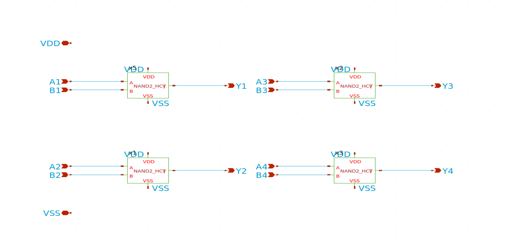
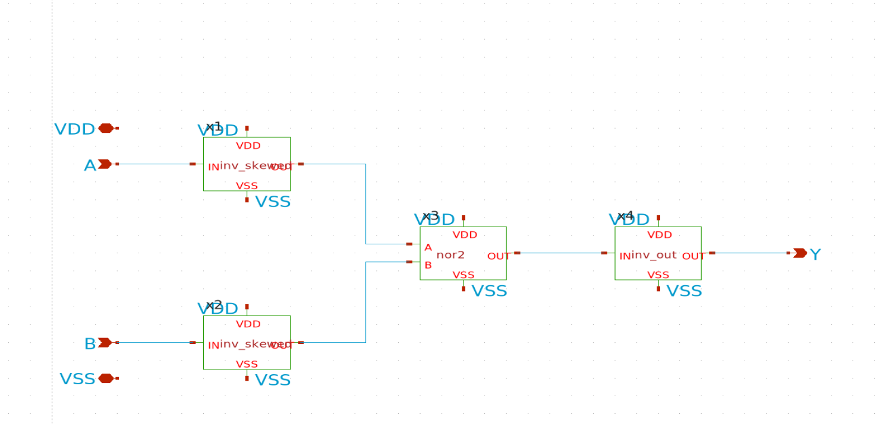

## How it works

This project is an open-source silicon implementation of **quad
2-input NAND** on the GlobalFoundries **gf180mcuD** process, operating from a
**3.3 V** supply. Each NAND gate presents a TTL-compatible input window
(V<sub>IL,max</sub> = 0.8 V, V<sub>IH,min</sub> = 2.0 V) and is sized for
**±4 mA** drive at the output.

The HCT input behaviour is realised through a skewed-inverter / NOR2 /
output-buffer chain rather than a plain CMOS NAND topology:

```
nand2\_hct  =  inv\_skewed (A) ─┐
              inv\_skewed (B) ─┴─►  nor2  ──►  inv\_out  ──►  Y
```

The four NAND gates share a common V<sub>DD</sub>/V<sub>SS</sub> rail pair.
Each gate output is routed to an analog pin in `ua\[0..3]` rather than to the
digital pins, allowing V<sub>OH</sub> and V<sub>OL</sub> to be measured at
the rated ±4 mA drive without the digital output buffer of the TT pad frame
in series.

Gate 1's A input (A<sub>1</sub>) is brought out exclusively on the
analog pin `ua\[4]` rather than on a digital `ui\_in` pin. This bypasses
the TT digital pad buffer entirely and is used for two purposes:
(a) functional drive at 0 V or 3.3 V for the truth-table test, and
(b) a slow DC ramp from 0 V to 3.3 V to characterise the HCT input
window on silicon. A digital `ui\_in` pin would otherwise snap any
intermediate voltage to a clean 0 V or 3.3 V at the TT pad buffer's
own CMOS threshold before it ever reached the gate, making the
HCT-window measurement impossible.

## Schematics

The design was captured in **xschem** and simulated in **ngspice**. Per-cell
LVS was performed in KLayout.

Chip-level testbench (`tb\_74hct00\_top.sch`):


Top-level schematic (`74hct00\_top.sch`):



NAND gate (`nand2\_hct.sch`):



Interior NOR2 (`nor2.sch`):


## Pinout

Tile input pins mapped to NAND gate inputs:

|Tile pin|Cell pin|
|-|-|
|`ua\[4]`|A1 (Gate 1 input A; truth-table drive + HCT-window DC sweep)|
|`ui\_in\[1]`|B1 (Gate 1 input B)|
|`ui\_in\[2]`|A2 (Gate 2 input A)|
|`ui\_in\[3]`|B2 (Gate 2 input B)|
|`ui\_in\[4]`|A3 (Gate 3 input A)|
|`ui\_in\[5]`|B3 (Gate 3 input B)|
|`ui\_in\[6]`|A4 (Gate 4 input A)|
|`ui\_in\[7]`|B4 (Gate 4 input B)|
|`ui\_in\[0]`|unused|

Tile output pins mapped to NAND gate outputs:

|Tile pin|Cell pin|
|-|-|
|`ua\[0]`|Y1 (Gate 1 output)|
|`ua\[1]`|Y2 (Gate 2 output)|
|`ua\[2]`|Y3 (Gate 3 output)|
|`ua\[3]`|Y4 (Gate 4 output)|

Power pins: `VDPWR` is the 3.3 V supply, `VGND` is ground.

## How to test

The procedure below is a basic functional verification of all four NAND gates.

1. Apply **3.3 V** between `VDPWR` and `VGND`.
2. For each gate *i*, drive the two input pins to either 0 V or 3.3 V
and read the corresponding output Y<sub>i</sub> on `ua\[i−1]`:

   - Gate 1: A<sub>1</sub> on `ua\[4]`, B<sub>1</sub> on `ui\_in\[1]`
   - Gate 2: A<sub>2</sub> on `ui\_in\[2]`, B<sub>2</sub> on `ui\_in\[3]`
   - Gate 3: A<sub>3</sub> on `ui\_in\[4]`, B<sub>3</sub> on `ui\_in\[5]`
   - Gate 4: A<sub>4</sub> on `ui\_in\[6]`, B<sub>4</sub> on `ui\_in\[7]`

   The output must follow the NAND truth table:

|A|B|Y|
|-|-|-|
|0|0|1|
|0|1|1|
|1|0|1|
|1|1|0|

3. **HCT input-window check.** Apply a slow DC ramp on `ua\[4]` from
0 V to 3.3 V while holding B<sub>1</sub> (`ui\_in\[1]`) at 3.3 V.
Observe Y<sub>1</sub> on `ua\[0]`. The output must remain at logic
high for V<sub>in</sub> ≤ 0.8 V and must be at logic low for
V<sub>in</sub> ≥ 2.0 V.

## External hardware

* 3.3 V DC power supply (≥ 50 mA capable).
* Digital multimeter for output-voltage measurement.
* (Optional) Variable low-voltage DC source for the HCT input-window check.

