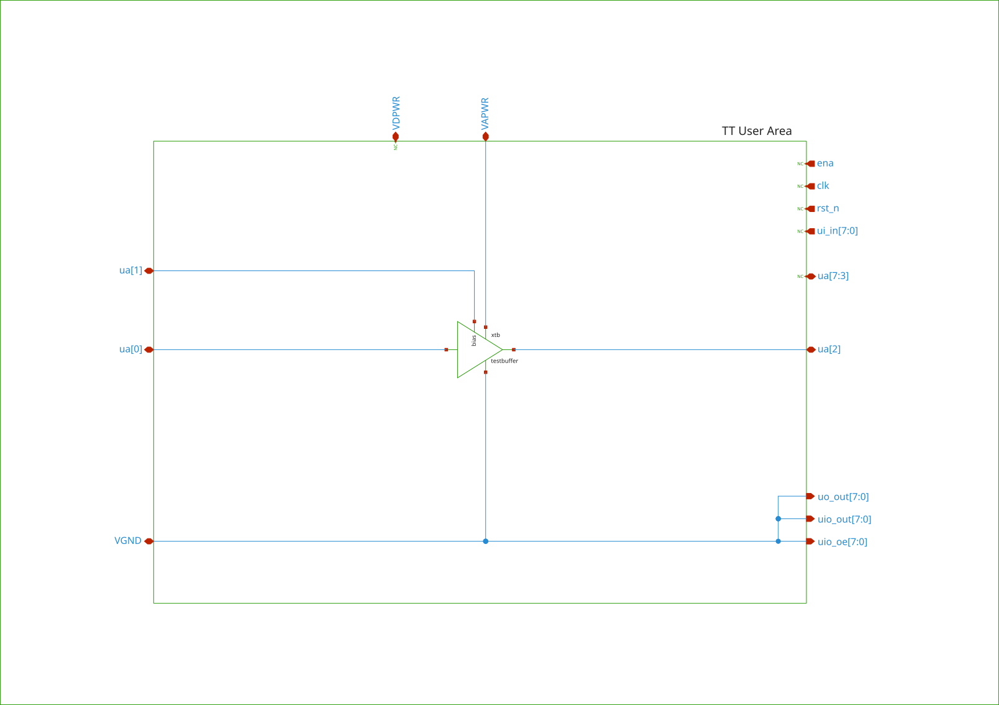

## How it works

A testbuffer that will buffer a voltage signal and drive a off-chip probe.

## How to test

- Bias the amplifier with a 5uA current from pin ua[1].
- Apply test signal to input pin ua[0] 
- Measure buffered signal at the output pin ua[2].

## External hardware

- Oscilloscope and function generator or voltage source and multimeter

## Specifications

| Parameter                        | Symbol.  | Min.  | Typ.  | Max.       | Unit.       | Condition                   |
| :---------------------------     | :------- | :---: | :---: | :--------: | :---------: | :------------------------   |
| Supply Voltage                   | Vdd      | 3.0   | 3.3   | 5.0        | V           |                             |
| Temperature Range                | T        | 0     |       | 75         | °C          |                             |
| Area                             | A        |       |       | 90x80      | µm²         |                             |
| Load Capacitance                 | Cl       |       | 10    | 50         | pF          |                             |
| Load Resistance                  | Rl       |       | 1     |            | MΩ          |                             |
| Bias Current                     | Ib       |       | 5     |            | µA          |                             |
| Supply Current                   | Idd      | 47.9  | 50.6  | 57.5       | µA          | Ib = 5µA, All PVT, Rl = 1MΩ |
| Power consumption                | Pd       | 143   | 167   | 292        | µW          | Ib = 5µA, All PVT, Rl = 1MΩ |
|                                  |          |       |       |            |             |                             |
| Input offset voltage             | Vos      |       | 10.2  |            | mV          | +-3σ, Vdd = 3.3V, T = 27°C  |
| Integrated noise                 | eni      | 30.9  | 36.3  | 42.3       | µVrms       | f = 0.1Hz to 1MHz           |
| Input referred noise             | en       | 9.39  |       | 11.45      | µV/sqrt(Hz) | f = 0.1Hz, All PVT          |
|                                  |          | 0.926 |       | 1.129      | µV/sqrt(Hz) | f = 10Hz,  All PVT          |
|                                  |          | 95.6  |       | 116.3      | nV/sqrt(Hz) | f = 1kHz,  All PVT          |
| Open Loop Gain                   | Avol     | 83.5  | 85.9  |            | dB          | All PVT, Rl=1MΩ             |
| Unity Gain Bandwidth             | UGBW     | 1.78  | 2.6   | 3.4        | MHz         | All PVT, Cl=10pF            |
| Phase Margin                     | φm       | 64.5  | 80    |            | °           | All PVT, Cl=10pF            |
| Slew Rate                        | SR       | 1.2   | 1.72  |            | MV/s        | All PVT, Cl=10pF            |
| Power Supply Rejection Ratio Pos | PSRR+    | 103   | 123   |            | dB          | f = 1Hz,   All PVT          |
|                                  |          | 85    | 88    |            | dB          | f = 100Hz, All PVT          |
|                                  |          | 65    | 68    |            | dB          | f = 1kHz,  All PVT          |
| Power Supply Rejection Ratio Neg | PSRR-    | 101   | 115   |            | dB          | f = 1Hz,   All PVT          |
|                                  |          | 88    | 91    |            | dB          | f = 10kHz,  All PVT         |

