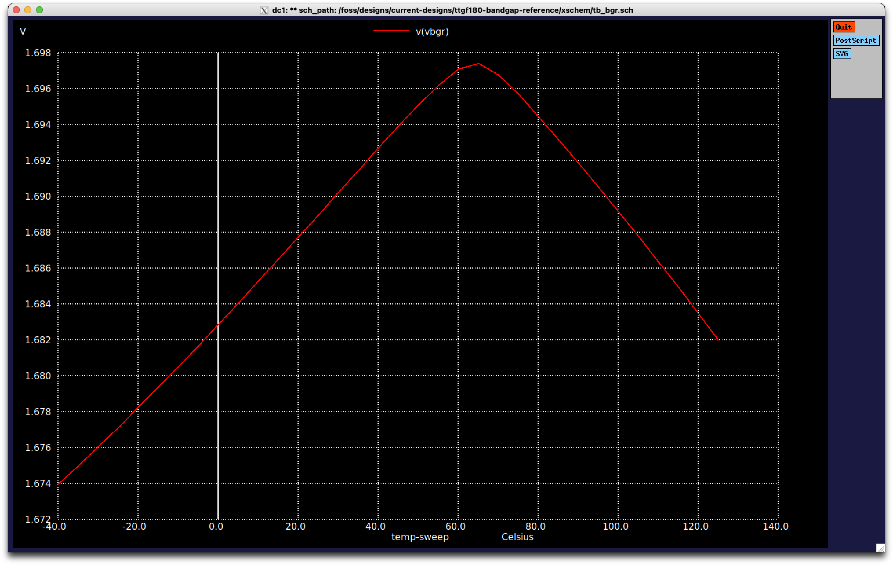

<!---

This file is used to generate your project datasheet. Please fill in the information below and delete any unused
sections.

You can also include images in this folder and reference them in the markdown. Each image must be less than
512 kb in size, and the combined size of all images must be less than 1 MB.
-->

## How it works

Outputs a stable reference voltage over a temperature range of -40C - 125C (varies by about 1% over that range in simulation)

There is no supply noise rejection or trimming in this design, it's a very simple design for providing a stable reference voltage.

## How to test

Apply 3.3V VAPWR and plot a graph of voltage over temperature for analog out[0] i.e. VBGR.

Confirm that variability is under 1% from -40C - 125C. Under simulation this range is from 1.674V - 1.697V for the typical corner.

Here's how the graph for vbgr looks.

## External hardware

1. 3.3V bench power supply
2. Digital Multimeter (6.5 digit)
3. Thermocouple (To measure temp)
4. Temperature chamber (Some way to vary chip temperature)
